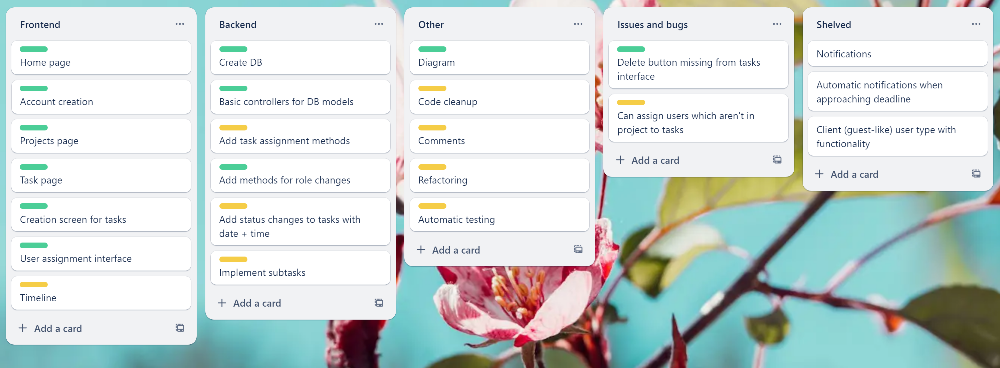
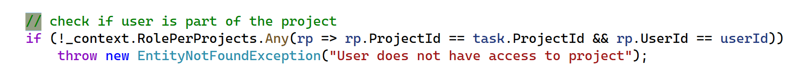
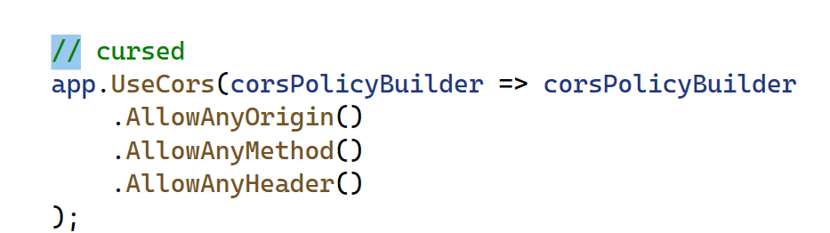
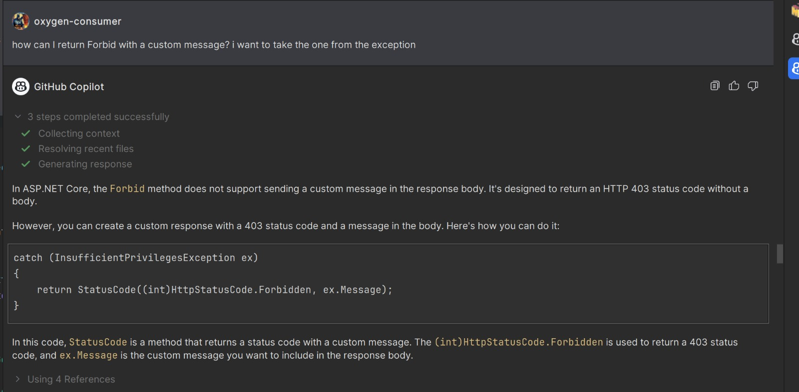
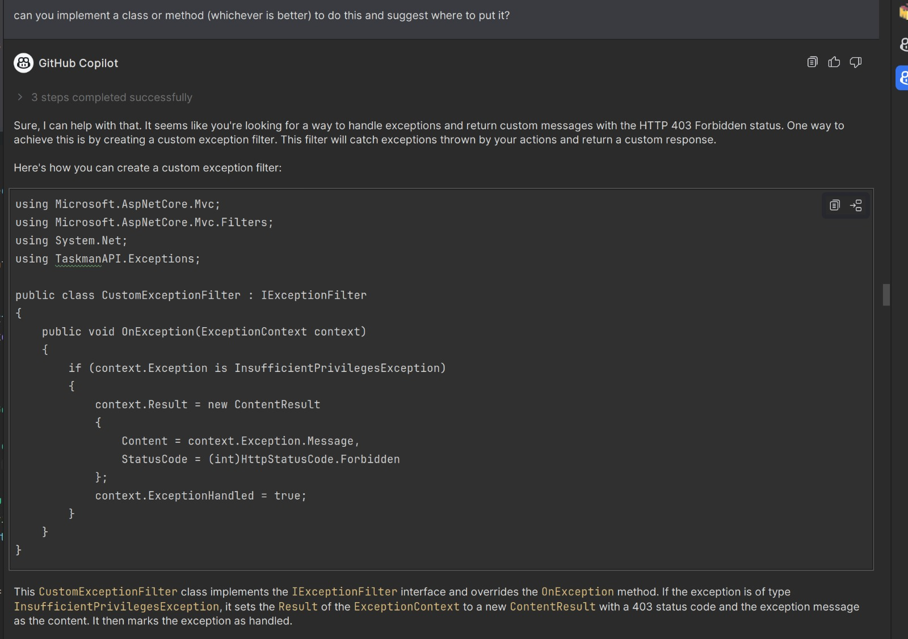
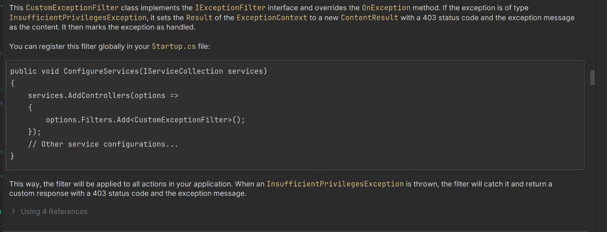

# Epic story

Taskman is a collaborative task management app catered to the needs of IT specialists who seek a platform on which to organize personal or team projects. This app aims to improve efficiency and productivity, and offers the ability to create projects, assign roles, create tasks and subtasks and assign users to tasks.

# User stories

1. As a project manager, I want to be able to create new projects, so that I can organize tasks effectively.

2. As a team member, I want to be able to view all tasks assigned to me across different projects, so that I can prioritize my work.

3. As a project manager, I want to be able to set deadlines for tasks and receive notifications when they are approaching or overdue, so that I can ensure timely completion of the project.

4. As a team member, I want to be able to see an overview of all projects I am involved in, including their statuses and progress, so that I can stay informed about the overall workload.

5. As a project manager, I want to be able to assign tasks to specific team members or groups, so that responsibilities are clearly defined.

6. As a team member, I want to be able to collaborate with other team members on tasks by sharing files, comments, and updates, so that we can work together efficiently.

7. As a project manager, I want to be able to track the time spent on each task by team members, so that I can monitor project costs and resource allocation.

8. As a team member, I want to be able to access the task management web app from any device, including desktop and mobile, so that I can stay productive on the go.

9. As a project manager, I want to be able to create task templates for recurring tasks, so that I can save time on task setup and ensure consistency across projects.

10. As a team member, I want to be able to search for tasks by keyword, tag, or other criteria, so that I can quickly find the information I need.

11. As a project manager, I want to be able to generate customizable reports on project progress, task completion rates, and team performance, so that I can communicate effectively with stakeholders. VERY NICE TO HAVE

12. As a team member, I want to be able to request feedback or approval on tasks from project managers or clients, so that I can ensure deliverables meet expectations.

13. As a project manager, I want to be able to set up recurring reminders for tasks or project milestones, so that nothing falls through the cracks.

14. As a team member, I want to be able to view a calendar view of tasks and deadlines, so that I can plan my work effectively and avoid conflicts.

15. As a project manager, I want to be able to integrate the task management web app with other tools such as calendars, email clients, and project management software, so that I can streamline workflows and reduce duplication of effort.

# Backlog

# Raportare bug si rezolvare cu pull request

Issue: [There is no delete button for tasks #17](https://github.com/oxygen-consumer/taskman/issues/17), pull request: [rezolvare buton issue #17 #21](https://github.com/oxygen-consumer/taskman/pull/21)

# Refactoring

[Courtesy of Zaha](https://github.com/oxygen-consumer/taskman/pull/16), thank you very much :\)

# Comentarii

# Folosirea unui tool de AI

